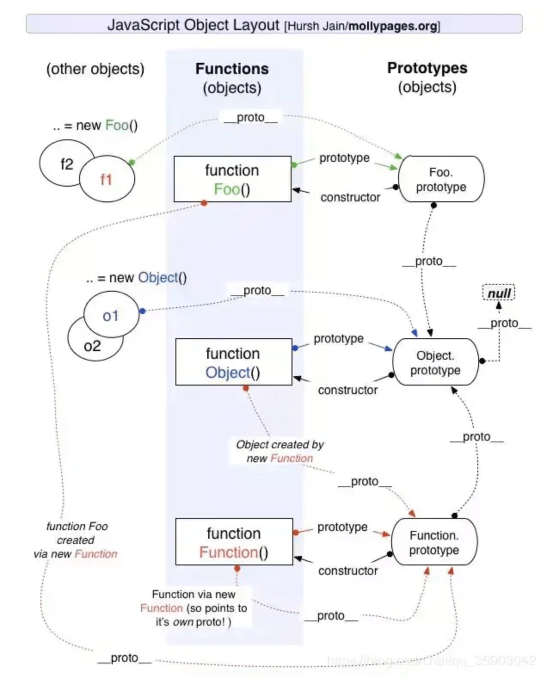
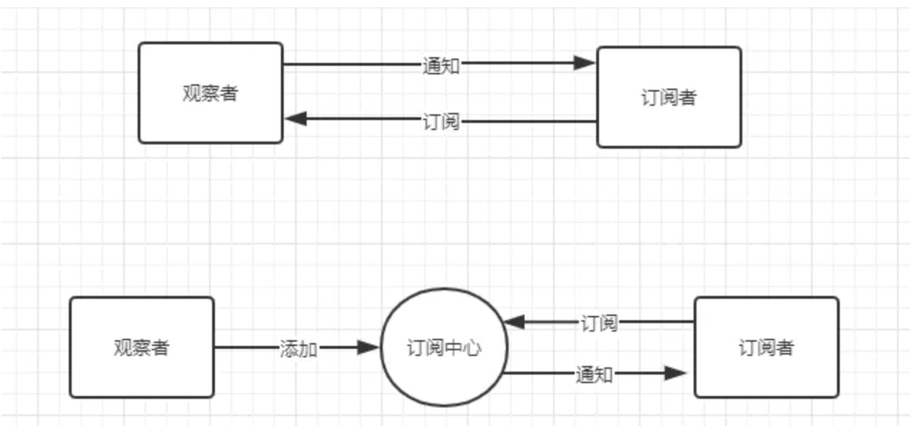

# JS 面试题

- [JS 面试题](#js----)
    + [JS 原型链](#js----)
        * [构造方法](#----)
    + [typeof 和 instanceof 的区别](#typeof---instanceof----)
    + [数据类型](#----)
    + [NaN 指的是什么](#nan------)
    + [什么是包装对象](#-------)
    + [什么是作用域链](#-------)
    + [写一个方法把下划线命名转换成大驼峰命名](#-------------------)
    + [去掉字符串最后一个指定字符](#-------------)
    + [闭包的作用](#-----)
        * [特性](#--)
        * [闭包常见用途](#------)
        * [优缺点](#---)
    + [Let、Var 和 const 的区别](#let-var---const----)
        * [为什么 var 可以重复声明](#----var-------)
    + [数据属性 和 访问器属性的区别](#---------------)
    + [toString 和 valueOf](#tostring---valueof)
    + [箭头函数有没有 arguments 对象?](#--------arguments----)
    + [JS 处理二进制](#js------)
    + [异步有哪些解决方案](#---------)
    + [CO库](#co-)
    + [JS 事件循环](#js-----)
    + [CommonJS 中的 require/exports 和 ES6 中的 import/export 有何区别](#commonjs----require-exports---es6----import-export-----)
    + [一行代码实现数组去重](#----------)
    + [如何判断两个对象相等](#----------)
    + [前端性能优化](#------)
    + [Object.defineProperty(obj, prop, descriptor)](#objectdefineproperty-obj--prop--descriptor-)
    + [Set 与 数组 的区别](#set---------)
    + [Set 和 Map  的区别](#set---map-----)
    + [Object、Map 的区别](#object-map----)
    + [WeakMap 和 Map 的区别](#weakmap---map----)
    + [JS 防抖和节流 debounce Throttle](#js-------debounce-throttle)
      - [代码实现](#----)
    + [Promise](#promise)
        * [状态](#--)
        * [基本过程](#----)
      - [代码实现](#-----1)
        * [构造函数](#----)
        * [then 方法](#then---)
        * [Handler 函数封装存储 `onResolved` `onRejected` 函数和新生成 `promise` 对象](#handler---------onresolved---onrejected----------promise----)
        * [Resolve 函数](#resolve---)
    + [CommonJS / AMD / CMD / ES6](#commonjs---amd---cmd---es6)
      - [CommonJS](#commonjs)
      - [AMD 和 require.js](#amd---requirejs)
      - [CMD 和 sea.js](#cmd---seajs)
      - [ES6 Module](#es6-module)
    + [JavaScript 的四种继承方式](#javascript--------)
    + [ES6](#es6)
      - [ES6 在字符串层面做了哪些优化](#es6-------------)
      - [ES6 的 Proxy](#es6---proxy)
      - [ES6 的 Reflect](#es6---reflect)
      - [Iterator 是什么](#iterator----)
      - [Class / extends 有什么用](#class---extends-----)
      - [Generator](#generator)
        * [与 Iterator 接口的关系](#--iterator------)
        * [next 方法的参数](#next------)
      - [for...of](#forof)
      - [for...of 与 for...in 的区别](#forof---forin----)
    + [线程和 进程的区别](#---------)
    + [函数式编程](#-----)
        * [柯里化 Currying](#----currying)
    + [线程和进程的区别](#--------)
    + [什么是尾递归？](#-------)
    + [观察者模式  和 发布-订阅模式的区别](#-------------------)
    + [Websocket](#websocket)
    + [参考资料](#----)

### JS 原型链



原型链重点分为三个部分

- __proto__
    - prototype
- prototype
    - __proto__
    - constructor
    


对于实例对象来说，原型链的作用：

- 实现继承
- 属性查找
- 实例类型判断：是否属于某类对象

##### 构造方法

构造方法就是一个可以被 new 的方法（箭头函数不能被 new）

实现一个模拟的 `new`

```js
function ObjectFactory () {
  const constructor = [].shift.call(arguments)
  const res = {}
  res.__proto__ = constructor.prototype
  const ret = constructor.apply(res, arguments)
  return typeof ret === 'object' ? ret : res
}
```

### typeof 和 instanceof 的区别

- typeof 用于比较基础数据类型和引用类型，返回值有 "number"、"string"、"boolean"、"null"、"function" 和 "undefined"、"symble"、"object"
- instanceof 对原型链中的 `__proto__` 逐层向上进行查找，通过instanceof 可以判断一个事例的父类型 和祖先类型的实例

### 数据类型

- 基本类型：Null Undefined Number String Bigint Symbol Boolean
- 引用类型：Object

基础类型 储存在栈内存中 | 大小是固定 | 在栈中可以快速查找 | 对值操作
引用类型 储存在堆内存中 | 大小不固定 | 栈内存储存内存地址 | 对地址操作

### NaN 指的是什么

NaN 属性代表非数字值的特殊值，该 属性用于表示某值不是数字

```js
typeof(NaN) // "number"
NaN == NaN // false
```

### 什么是包装对象

包装对象，只要是为了便于基本类型调用对象的方法。String Boolean Number

### 什么是作用域链

作用域链分为两种

- 全局作用域：绑定在 window 上，为全部作用域链 的最顶层
- 函数作用域：函数执行的时候有一个执行栈，函数执行的时候会创建执行环境，就是执行上下文对象，上下文对象中有一个大对象，保存函数执行的时候所有可能用到的变量/函数，在使用变量时就会访问这个大对象，这个对象随着函数的调用而创建，随着函数的执行结束出栈而销毁，这个大对象组成的链就叫作用域链。
 
```js
function test() {
    for (var index = 0; index < 3; index++) {
        setTimeout(() => {
            console.log('index:' + index)
        })
    }
}

test() 
//  index:3
//  index:3
//  index:3
```

因为JS 的时间循环机制，定时器的回调肯定在循环结束后执行，那时候index已经等于3了。

### 写一个方法把下划线命名转换成大驼峰命名

```js
function toCamel(str) {
  str = str.replace(/(\w)/, (match, $1) => `${$1.toUpperCase()}`)
  while(str.match(/\w_\w/)) {
    str = str.replace(/(\w)(_)(\w)/, (match, $1, $2, $3) => `${$1}${$3.toUpperCase()}`)
  }
  return str
}
```

### 去掉字符串最后一个指定字符

```js
const removeLastTarget = (str, target) => {
  const tmpArr = str.split('')
  tmpArr.splice(str.lastIndexOf(target), target.length)
  return tmpArr.join()
}
```

方法二

```js
String.prototype.reverse = function () {
  return this.split('').reverse().join('')
}

String.prototype.removeFirstChar = function (m) {
    return this.replace(m, '')
}

const string = 'emamam, your string'
const removedChar = 'm'
string.reverse().removeFirstChar(removedChar).reverse()
```

### 闭包的作用

MDN 关于闭包的定义：闭包是指那些能够访问自由变量的函数

自由变量：函数中使用的， 但既不是函数参数也不是函数的局部变量的变量。

- 理论角度：所有函数，因为他们都在创建的时候就将上层上下文的数据保存起来了，哪怕是简单的全局变量也是如此，因为函数中访问全局变量就相当于是在访问自由变量，这个时候使用最外层作用域
- 实践角度：
    - 及时创建他的上下文已经销毁，他仍能存在
    - 在代码中引用了自由变量

##### 特性

- 函数嵌套函数
- 函数内部可以引用函数外部的参数和变量（由于链式作用域）
- 参数和变量不会被垃圾回收机制回收

##### 闭包常见用途

- 创建特权方法用于访问控制
- 事件处理程序及回调

##### 优缺点
      
- 优点：在内存中维持了一个变量，由于闭包，无法通过其他途径访问，从而达到保护变量安全的效果
- 缺点：参数和变量不会被垃圾回收机制回收

### Let、Var 和 const 的区别

- var: 解析器在解析js的时候，会将脚本都扫描一遍，将变量的生命提前到代码块的顶部，赋值还是在原先的为止，若在赋值前使用，就会出现展示性死区 undefined
- let: 声明只在当前代码块内，var 的声明会被提升到全局中
- const: 不可重复声明

##### 为什么 var 可以重复声明

编译器会对代码进行拆解，他会使用LHS 和 RHS 查询解析 = 左右两边的代码。当引擎执行 `var head = 2`的时候，他会首先执行 `var head` 声明变量，声明时会到作用域中查找是否有 `head` 这个变量，如果没有，则新建一个变量命名为 `head`。如果有，则将变量赋值为2
[参考](https://www.cnblogs.com/neil080320/p/6529679.html)

### 数据属性 和 访问器属性的区别

Object.defineProperty

1. 数据属性（数据描述符）

- [[Configurable]]：表示能否通过 delete 删除属性从而定义属性，能否修改属性的特征，或者 能否把属性修改为访问器属性
- [[Enumerable]]: 表示能否通过 for-in 循环
- [[value]]: 属性值

```js
var p = {
    name:'dage'
}
Object.defineProperty(p,'name',{
    value:'xxx'
})
p.name = '4rrr'
console.log(p.name) // 4rrr
Object.defineProperty(p,'name',{
    writable:false,
    value:'again'
})
p.name = '4rrr'
console.log(p.name) // again
```

2. 访问器属性

可以理解为取值和赋值前的拦截器

[[Enumerable]]：表示能否通过 for-in 循环返回属性，默认 false

[[Get]]：在读取属性时调用的函数。默认值为 undefined

[[Set]]：在写入属性时调用的函数。默认值为 undefined

```js
var p = {
    name:''
}
Object.defineProperty(p,'name',{
    get:function(){
        return 'right yeah !'
    },
    set:function(val){
        return 'handsome '+val
    }
})
p.name = `xiaoli`
console.log(p.name) // right yeah !
```

### toString 和 valueOf

```js
let o = function () {
    this.toString = () => {
        return 'my is o,'
    }
    this.valueOf = () => {
        return 99
    }
}
let n = new o()
console.log(n + 'abc') // 99abc
console.log(n * 10) // 990
// 有没有很酷炫
```

当这两个函数同时存在时候，会先调用 valueOf ，若返回的不是原始类型，那么会调用 toString 方法，如果这时候 toString 方法返回的也不是原始数据类型，那么就会报错 TypeError: Cannot convert object to primitive value 如下

### 箭头函数与普通函数的区别

- 箭头函数在浏览器中没有 `arguments` 对象，在 node 中有 `arguments` 但是只能获取到长度
- `this` 指向不一样
- 不能使用 `new` 关键字，即不能作为构造函数

### JS 处理二进制

ArrayBuffer：用来表示通用的长度固定的二进制缓冲区，作为内存区域，可以存放多种类型的数据，他不能直接读写，只能通过视图类读写。

### 异步有哪些解决方案

- 回调函数：通过嵌套调用实现
- Generator：异步任务的容器，生成器本质上是一个特殊的迭代器，Generator 执行后返回一个指针对象，调用该对象的next 方法将指针移动到下一个位置。返回一个对象 {value: 执行结果, done: 是否结束}
- Promise
- GO：Generator + Promise
- async/await

### CO库

co 用 promise 的特性，将 Generator 包裹在 Promise 中，然后循环执行 next 函数，把 next 函数返回的的 value  用 promise 包装，通过 then.resolve 调用下一个 next 函数，并将值传递给 next 函数，直到 done 为 true，最后执行包裹 Generator 函数的 resolve。

### JS 事件循环

- [js事件循环](https://cloud.tencent.com/developer/article/1332957)

事件循环的主要部分有 一个栈、两个队列、一套幕后线程。

开始的时候，执行栈中会执行全部的同步代码，同步代码中如果有异步函数调用如 setTimeout、http请求等，会将对应的请求放到幕后线程去处理。当幕后线程处理完异步请求，比如setTimeout 的时间到了，或者http请求获得响应，并且当执行栈中全部执行完毕（为空），会触发一次事件循环，将执行宏任务队列中第一个任务，任务执行完毕，执行微任务队列中的全部任务。微任务队列全部执行完成为空后，事件循环再次启动，执行下一个宏任务。如果当前任务队列为空，他会一直循环等待任务的到来，这就叫任务循环

- 宏任务（比较大型的工作）：setTimeout setInterval 用户交互操作 UI渲染
- 微任务（比较小型的工作）：Promise process.nextTick

注意

在执行微任务的时候，如果微任务队列中一直 持续不断的有微任务，那么就会导致主线程一直执行，没有办法进入下一个事件循环。导致我们无法进行 IO请求/UI渲染/ajax 请求等。应该避免这种情况。

### CommonJS 中的 require/exports 和 ES6 中的 import/export 有何区别

- CommonJS 的 require 加载时执行，缓存本地，而import 在执行时执行，不会缓存
- CommonJS 的 module 代表整个模块，`module.exports` 代表模块的输出，所以在 require 的时候实际上 require 的是 module 的 exports 属性
    export 命令是对外的接口，必须与模块内部变量建立一对一关系。

### 一行代码实现数组去重　

```js
[...new Set([1,2,33,2,1,2,33])]
```

### 如何判断两个对象相等

1. 递归遍历
2. JSON.stringify

### 前端性能优化

- 算法优化
- CDN
- 图片压缩
- 使用浏览器缓存
- 图片懒加载
- 页面滚动加载
- JS、CSS、HTML 等文件压缩
- 开启web服务器的 gzip
- 使用 nginx 反向代理
- 减少 DOM 操作

### Object.defineProperty(obj, prop, descriptor)

- obj 对象
- prop 要定义活修改的属性的名称
- descriptor 将定义活修改的属性描述符

### Set 与 数组 的区别 

- 数组是有序的列表，Set 是无序的
- Set 成员值都是唯一的

Set中的对象引用都是强化类型，并不会允许垃圾回收，ES6中引入 WeakSet，允许从内存中清除不再需要的被这些集合所引用的对象。

### Set 和 Map  的区别

- Set 类似数组，不过他的所有成员值都是唯一的
- Map 类似对象，是键值对，但是键的范围不限于字符串，各种类型的值都可以作为键

### Object、Map 的区别


### WeakMap 和 Map 的区别

- Map 的键可以是任意类型，而 WeakMap 的键只能是 对象类型
- WeakMap 不能包含无引用对象，如果没有引用，则会被垃圾回收立即清除
- WeakMap 对象不可枚举，无法获取大小

### JS 防抖和节流 debounce Throttle

Debounce 防抖：在事件最后一次触发 n 毫秒之内执行事件，不管事件曾被触发过多少次。
Throttle 节流：事件在第一次触发后 n 毫秒内，不论事件是否继续被触发，都执行。

- [参考](https://juejin.im/entry/59aacd04518825242c423fa0): 浅谈throttle以及debounce的原理和实现

#### 代码实现

```js
const base = function (fn, wait, debounce) {
  let timer
  return function() {
    let context = this, args = arguments
    if (debounce && timer) clearTimeout(timer)
    if (debounce || !timer) {
      timer = setTimeout(function () {
        timer = null
        fn.apply(context, args)
      }, wait)
    }
  }
}

const debounce = function (fn, wait) {
  base(fn, wait, true)
}

const throttle = function (fn, wait) {
  base(fn, wait, false)
}
```

### Promise 

##### promise是同步还是异步的？

- promise本身是同步的
- promise的回调then是异步的

##### 状态

- pending: 等待
- fulfilled：执行
- onRejected：拒绝

状态只在第一次修改时有效，之后状态 immutable

##### 基本过程

- 初始化一个Promise对象的时候，状态为pending，会立即执行传入的参数
- 传入的方法有两个参数  onFulfilled 和 onReject
- 执行 then 函数注册回调处理数组
- Promise 里的关键是必须保证，then方法传入的参数，必须在then方法被调用的那一轮事件循环之后的新执行栈中执行

#### 代码实现

##### 构造函数

```js
function Promise(fn) {
  this._state = 0
  this._value = null
  this._defereds = []

  try {
    fn(value => {
      resolve(this, value)
    }, reason => {
      reject(this, reason)
    })
  } catch(e) {
    reject(this, e)
  }
}
```

##### then 方法

- 实力化空的 `Promise` 对象用来返回
- 构造 `then(..)` 注册回调处理函数结构体
- 判断当前 `promise` 状态，`pending` 状态存储延迟处理对象 `deferred`，非 `pending` 状态执行 `onResolve` / `onReject` 回调

```js
Promise.prototype.then = function(onResolved, onRejected) {
  const res = new Promise(function() {})
  var deferred = new Handler(onResolved, onRejected, res)

  if (this._state === 0) {
    this._defereds.push(deferred)
    return res
  }

  handleResolved(this, deferred)
  return res
}
```

**QA: 为何要返回新的Promise 对象：因为在then 中会改变Promise的状态，但是Promise对象的状态应该是不可改变的**
- handleResolved： 根据当前 `Promise` 的状态，异步执行 `resolve` 活 `reject`

##### Handler 函数封装存储 `onResolved` `onRejected` 函数和新生成 `promise` 对象

```js
function Handler(onResolved, onRejected, promise) {
  this.onResolved = typeof onResolved === 'function' ? onResolved: null
  this.onRejected = typeof onRejected === 'function' ? onRejected: null
  this.promise = promise
}
```

##### Resolve 函数

resolve(promise, x)

- 如果 `Promise` 和 `x` 指向同一个对象，则忽略
- 如果 `x` 为 `Promise`，则使得 当前 `promise` 接受 `x` 的状态
- 如果 `then` 是函数，将 `x` 作为函数的作用域 `this` 调用
- 如果 `x` 不为对象或函数，以 `x` 为参数执行 `promise`

```js
function resolve(data) {
  function fn() {
    const { then } = data
    if (then && typeof then === 'function' ) {
      then.call()
    }
  }

  setTimeout(fn, 0)
}
```

### CommonJS / AMD / CMD / ES6

#### CommonJS

NodJS  是 CommonJS 规范的主要实践者，以同步的方式加载模块。在服务器端，模块文件都存在本地磁盘，读取非常快所以不会出问题。

四个重要变量对模块化提供支持:

- `module`: 代表模块
- `exports`：module.exports 代表模块输出
- `require`：引入模块
- `global`：全局

#### AMD 和 require.js

AMD 采用异步方式加载模块，模块的加载不影响它后面的语句运行，所有依赖与这个模块的语句都定义在一个回调函数中，等加载完成后，这个回调函数才会运行。

require.js 的 AMD 实现

- require.config() 指定引用路径
- define() 定义模块
- require() 引入模块
- require.config()

#### CMD 和 sea.js

CMD 是另一种js模块化方案，它与AMD很类似，不同点在于：AMD 推崇依赖前置、提前执行，CMD推崇依赖就近 、延迟执行。

```js
// AMD
define(['a', 'b', 'c'], function(a, b, c) {

})

//  CMD
define(function(require, exports, module) {
    var a = require('./a');
})
```

#### ES6 Module

ES6 在语言层面实现了模块功能，用起来非常简单，主要由两个命令构成 export 和 import

ES6  与 CommonJS 模块的差异

1. CommonJS输出 的 是值的拷贝 ES6 模块输出的是引用
2. CommonJS 模块是运行时加载，ES6是编译时输出接口

### JavaScript 的四种继承方式

- 原型链继承

```js
function Person(name, age) {
  this.name = name
  this.age = age
}

Person.prototype.say = function() {
    alert(this.name+" is garbage!");
}

function Main() {}

Man.prototype = new Person('霍顿',22);//这句是重点，敲黑板
```

- 构造函数继承

```js
function Main(name,age) {
  Person.apply(this, arguments)
}
```

- （原型链 + 构造函数）组合继承

```js
function Man(name, age) {
  Person.apply(this, arguments)
}

Man.prototype = new Person()
```

- 寄生继承

```js
function Main(name, age) {
  Person.apply(this, arguments)
}

Man.prototype = Object.create(Person.prototype)
Man.prototype.constructor = Man
```

- ES6 中继承

### ES6

#### ES6 在字符串层面做了哪些优化

1. 优化：增加了字符串模版 \`AA${aa}AA\`
2. 升级：增加了 inclouds() 方法及 startsWith endsWith padStart padEnd repeat

#### ES6 的 Proxy

Proxy 用来改变JS 默认的一些语言行为，包括拦截默认的 get/set 方法，使的 JS 的使用自由度更高

```js
function createMyOwnObj() {
  return new Proxy({}, {
    get(target, propKey, receiver) {
      return new Promise((resolve, reject) => {
        setTimeout(() => {})
      })
    } 
  })
}

let myObj = createMyOwnObj()

myObj.hahaha.then(result => {
	console.log(result) //你的hahaha运气不错，成功了
}).catch(error => {
	console.log(error) //你的hahaha运气不行，失败了
})
``` 

#### ES6 的 Reflect

#### Iterator 是什么

Set/Map 不能使用 for 循环遍历，为了实现遍历，官方提供一个Iterator 接口

Iterator标准的具体实现是Iterator遍历器。Iterator标准规定，所有部署了key值为[Symbol.iterator]，且[Symbol.iterator]的value是标准的Iterator接口函数(标准的Iterator接口函数: 该函数必须返回一个对象，且对象中包含next方法，且执行next()能返回包含value/done属性的Iterator对象)的对象，都称之为可遍历对象，next()后返回的Iterator对象也就是Iterator遍历器。

```js
let obj = {
  data: ['hello', 'world'],
  [Symbol.iterator]() {
    const self = this
    let index = 0
    return {
      next() {
        if (index < self.data.length) {
          return {
            value: self.data[index++],
            done: false
          }
        } else {
          return { value: undefined, done: true }
        } 
      } 
    }
  }
}
```

#### Class / extends 有什么用

ES6 的 class 可以看作只是一个 ES5生成实例对象的构造函数的语法糖，让对象原型写法更清晰，对象是梨花是一种面向对象编程。Class 类 可以通过 extends 实现继承。
事实上
- 类内部定义的所有方法都是不可枚举的
- ES6 的 class 类必须用 new 命令操作
- ES6 的 class 类不存在变量提升，必须先定义class 之后才能实例化
- ES5 的继承，实质是创造子类的实例对象 this，然后在将父类的属性和方法，加到this 上。ES6 的继承机制完全不同，实质是先将父类实例对象的属性和方法，加到this上面，（所以必须先调用super 方法），然后在用子类的构造函数修改 this

#### Generator

Generator 是 ES6 提供的一种异步编程解决方案，可以理解为是一个状态机，内部封装了多个状态/

执行Generator 会返回一个遍历器对西那个，也就是说，Generator 函数除了状态机，还是一个遍历器对象生成函数。返回的遍历器对象，可以依次遍历 Generator 函数内部的每一个状态。

特征

- function关键词与函数名之间有 *
- 函数体内部使用 yield  变大时，定义不同的内部状态 （yield 产出）

```js
function* helloWorldGenerator() {
  yield 'hello';
  yield 'world';
  return 'ending';
}

var hw = helloWorldGenerator();
```

`helloWorldGenerator` 函数有 `hello`、`world` 及 `ending` 三个状态。

调用 `Generator` 函数后，该函数 并不执行，返回的 也不是函数运行结果，而是指向内部状态的指针对象，也就是 `Iterator`。必须调用 `next` 方法使指针移动到下一个状态。也就是，每次调用next 方法，内部指针就 从函数头部或上一次 停下来的地方开始执行，直到遇到下一个 `yield` 或 `return` 为止

##### 与 Iterator 接口的关系

```js
var myIterable = {};
myIterable[Symbol.iterator] = function* () {
  yield 1;
  yield 2;
  yield 3;
};

[...myIterable] // [1, 2, 3]
```

##### next 方法的参数

yield 表达式本身没有返回值，或者说总是返回 undefined。next 方法可以带一个参数，该参数会被当作上一个 yield 表达式的返回值。

#### for...of

for...of 在可迭代对象 (Array, Map, Set, String, TypedArray, arguments, Generator, Iterator) 上创建一个迭代循环，调用自定义迭代 钩子，并未不同属性 的值执行 语句

[参考 MDN for...of](https://developer.mozilla.org/zh-CN/docs/Web/JavaScript/Reference/Statements/for...of)

#### for...of 与 for...in 的区别

- `for...in` 语句以任意顺序迭代对象 的可枚举属性
-`for...of` 语句遍历可迭代对象定义迭代数据

```js
Object.prototype.objCustom = function() {}; 
Array.prototype.arrCustom = function() {};

let iterable = [3, 5, 7];
iterable.foo = 'hello';

for (let i in iterable) {
  console.log(i); // logs 0, 1, 2, "foo", "arrCustom", "objCustom"
}

for (let i in iterable) {
  if (iterable.hasOwnProperty(i)) {
    console.log(i); // logs 0, 1, 2, "foo"
  }
}

for (let i of iterable) {
  console.log(i); // logs 3, 5, 7
}
``` 

### 线程和 进程的区别

### 函数式编程

##### 柯里化 Currying

> 柯里化 是把接受多个参数的函数变成接受一个单一参数（最初函数的第一个参数）的函数，并返回接受余下的参切返回结果的心函数的技术

特点

- 参数复用
- 业务解偶 调用时机灵活
- 延迟执行 部分求值

```js
let curry2 = (fn, ...args) => {
  let len = fn.length
  return (...rest) => {
    let allArgs = args.slice(0)
    console.log('allArgs:', allArgs, 'len:', len)
    allArgs.push(...rest)
    if (allArgs.length < len) {
      return curry2.call(this, fn, ...allArgs)
    } else {
      return fn.apply(this, allArgs)
    }
  }
}
```

### 线程和进程的区别

- 进程：一个动态过程，是一个活动的实体。简单来说，一个应用程序的运行可以看作是一个进程
- 线程：程序执行流的最小执行单位，是进程中的实际运作单位

### 什么是尾递归？

函数内部循环调用其自身的函数是递归函数。若函数没有执行完毕，执行栈中会一直保持着这个函数的相关变量，一直占用内存，当递归次数过大的时候，就可能会出现内存溢出，也叫爆栈，页面可能会卡死。所以为了避免出现这种情况，可以采用尾递归

尾递归：在函数调用最后一步调用函数，进入下一个函数不再需要上一个函数的环境了，内存空间O(n) 到 O(1) 的优化，这就是尾递归。尾递归的优势：可以释放外层函数的调用站，较少栈层级，节省内存开销，避免内存溢出。

### 观察者模式  和 发布-订阅模式的区别

两者都是订阅-通知的模式，区别在于：

观察者模式：观察者和订阅者是互相知道彼此的，是一个紧耦合的设计
发布-订阅：观察者和订阅者是不知道彼此的，因为他们中间是通过一个订阅中心来交互的，订阅中心存储来多个订阅者，当有新的发布的时候，就会通知订阅者



### Websocket

Websocket 是应用层协议，基于 TCP，与 HTTP 协议一样位于应用层，都是 TCP/IP 协议的子集

HTTP 协议是单向通讯，只有客户端发起HTTP请求，服务端才会返回数据。而 WebSocket 协议是双向通信协议，在建立链接后，客户端和服务器都可以主动向 对方发送或接受数据


### 参考资料

- [面试总结：javascript 面试点汇总](https://juejin.im/post/5e523e726fb9a07c9a195a95#heading-4)

### JS 事件委托

这里用父级ul做事件处理，当li被点击时，由于冒泡原理，事件就会冒泡到ul上，因为ul上有点击事件，所以事件就会触发，当然，这里当点击ul的时候，也是会触发的，那么问题就来了，如果我想让事件代理的效果跟直接给节点的事件效果一样怎么办，比如说只有点击li才会触发。

Event对象提供了一个属性叫target，可以返回事件的目标节点，我们成为事件源，也就是说，target就可以表示为当前的事件操作的dom，但是不是真正操作dom，当然，这个是有兼容性的，标准浏览器用ev.target，IE浏览器用event.srcElement，此时只是获取了当前节点的位置，并不知道是什么节点名称，这里我们用nodeName来获取具体是什么标签名，这个返回的是一个大写的，我们需要转成小写再做比较（习惯问题）：

